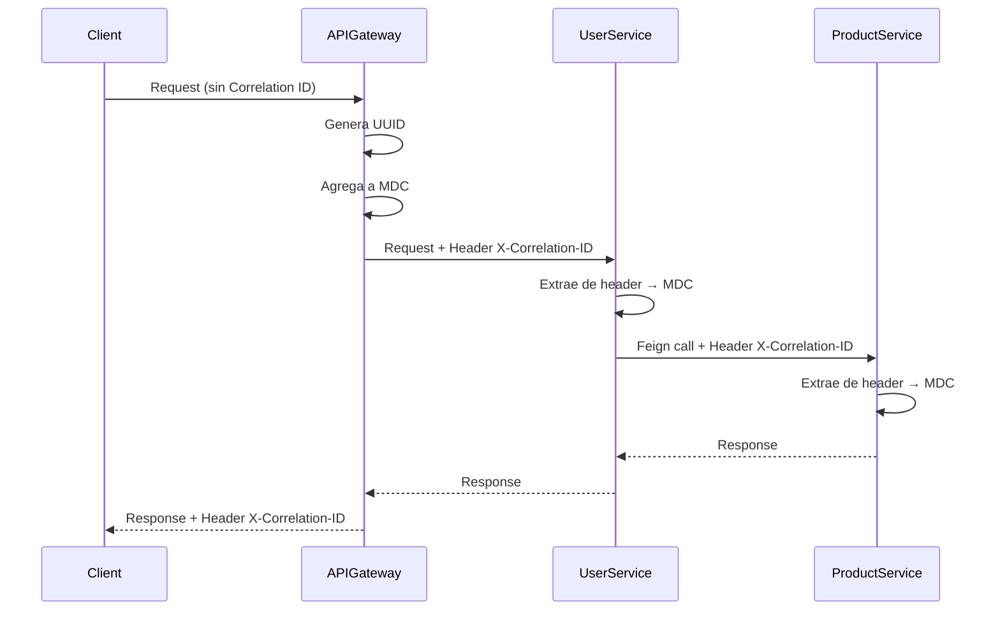

# Patrones de Diseño Implementados

Este documento detalla los tres nuevos patrones de diseño implementados en la arquitectura de microservicios de e-commerce.

---

## 1. Bulkhead Pattern (Patrón de Resiliencia)

### Descripción

El **Bulkhead Pattern** proporciona aislamiento de recursos mediante la separación de pools de threads para diferentes tipos de operaciones. Esto previene que operaciones no críticas consuman todos los recursos y afecten operaciones críticas del sistema.

### Implementación

**Ubicación**: [`user-service`](file:///home/danna/Desktop/2.Ingesoft/ecommerce-microservice-backend-app/user-service)

#### Configuración (application.yml)

```yaml
resilience4j:
  bulkhead:
    instances:
      userServiceCritical:
        max-concurrent-calls: 10
        max-wait-duration: 100ms
      userServiceNonCritical:
        max-concurrent-calls: 5
        max-wait-duration: 50ms
  thread-pool-bulkhead:
    instances:
      userServiceAsync:
        max-thread-pool-size: 4
        core-thread-pool-size: 2
        queue-capacity: 20
        keep-alive-duration: 20ms
```

#### Uso en Código

**Operaciones Críticas** (save, update, delete, findById):
```java
@Bulkhead(name = "userServiceCritical", fallbackMethod = "saveFallback")
public UserDto save(final UserDto userDto) {
    return UserMappingHelper.map(this.userRepository.save(UserMappingHelper.map(userDto)));
}

public UserDto saveFallback(final UserDto userDto, Exception e) {
    log.error("*** Bulkhead fallback: save - service overloaded", e);
    throw new RuntimeException("Service temporarily unavailable. Please try again later.");
}
```

**Operaciones No Críticas** (findAll, findByUsername):
```java
@Bulkhead(name = "userServiceNonCritical", fallbackMethod = "findAllFallback")
public List<UserDto> findAll() {
    return this.userRepository.findAll()
            .stream()
            .map(UserMappingHelper::map)
            .collect(Collectors.toUnmodifiableList());
}

public List<UserDto> findAllFallback(Exception e) {
    log.warn("*** Bulkhead fallback: findAll - returning empty list due to: {}", e.getMessage());
    return List.of();
}
```

#### Clase de Configuración

[`BulkheadPatternConfig.java`](file:///home/danna/Desktop/2.Ingesoft/ecommerce-microservice-backend-app/user-service/src/main/java/com/selimhorri/app/config/BulkheadPatternConfig.java)

```java
@Configuration
public class BulkheadPatternConfig {
    @Bean
    public BulkheadRegistry bulkheadRegistry() {
        BulkheadRegistry registry = BulkheadRegistry.ofDefaults();
        
        registry.bulkhead("userServiceCritical").getEventPublisher()
            .onCallRejected(event -> 
                log.warn("Bulkhead [userServiceCritical] - Call REJECTED"));
        
        return registry;
    }
}
```

### Beneficios

**Aislamiento de Recursos**: Operaciones críticas siempre tienen recursos disponibles  
**Prevención de Cascadas de Fallos**: Evita que operaciones lentas bloqueen todo el sistema  
**Degradación Controlada**: Fallback methods proporcionan respuestas alternativas  
**Monitoreo**: Event listeners permiten tracking de rechazos y uso de recursos  
**Configuración Flexible**: Diferentes límites para diferentes tipos de operaciones

### Métricas Disponibles

- `resilience4j.bulkhead.available.concurrent.calls`
- `resilience4j.bulkhead.max.allowed.concurrent.calls`
- `resilience4j_bulkhead_calls_total`

---

## 2. Feature Toggle Pattern (Patrón de Configuración)

### Descripción

El **Feature Toggle Pattern** permite activar o desactivar funcionalidades dinámicamente sin necesidad de redesplegar la aplicación. Esto facilita:
- Despliegues graduales (canary releases)
- Activación de features por entorno
- Rollback instantáneo de features problemáticas

### Implementación

**Ubicación**: Nuevo microservicio [`feature-toggle-service`](file:///home/danna/Desktop/2.Ingesoft/ecommerce-microservice-backend-app/feature-toggle-service)

#### Arquitectura del Servicio

```
feature-toggle-service/
├── domain/
│   └── FeatureToggle.java          # Entidad JPA
├── repository/
│   └── FeatureToggleRepository.java # Repositorio Spring Data
├── service/
│   └── FeatureToggleService.java   # Lógica de negocio con caché
├── controller/
│   └── FeatureToggleController.java # API REST
├── annotation/
│   └── @FeatureToggle              # Anotación custom
└── aspect/
    └── FeatureToggleAspect.java    # AOP para interceptar métodos
```

#### Entidad

```java
@Entity
@Table(name = "feature_toggles")
public class FeatureToggle {
    @Id
    @GeneratedValue(strategy = GenerationType.IDENTITY)
    private Long id;
    
    @Column(unique = true, nullable = false)
    private String name;
    
    @Column(nullable = false)
    private Boolean enabled = false;
    
    private String description;
    private String environment; // dev, stage, prod
    
    @CreationTimestamp
    private LocalDateTime createdAt;
    
    @UpdateTimestamp
    private LocalDateTime updatedAt;
}
```

#### API REST Endpoints

| Método | Endpoint | Descripción |
|--------|----------|-------------|
| GET | `/api/features` | Listar todos los feature flags |
| GET | `/api/features/{id}` | Obtener feature por ID |
| GET | `/api/features/check/{name}?environment=dev` | Verificar si feature está habilitado |
| POST | `/api/features` | Crear nuevo feature flag |
| PUT | `/api/features/{id}` | Actualizar feature flag |
| PUT | `/api/features/{name}/enable` | Habilitar feature |
| PUT | `/api/features/{name}/disable` | Deshabilitar feature |
| DELETE | `/api/features/{id}` | Eliminar feature flag |

#### Uso con Anotación

```java
@Service
public class ProductService {
    
    @FeatureToggle(name = "advanced-search", fallbackMethod = "basicSearchFallback")
    public List<Product> advancedSearch(String query) {
        // Nueva funcionalidad de búsqueda avanzada
        return performAdvancedSearch(query);
    }
    
    public List<Product> basicSearchFallback(String query) {
        // Búsqueda básica como fallback
        return performBasicSearch(query);
    }
}
```

#### Aspecto AOP

```java
@Aspect
@Component
public class FeatureToggleAspect {
    @Around("@annotation(com.selimhorri.app.annotation.FeatureToggle)")
    public Object checkFeatureToggle(ProceedingJoinPoint joinPoint) throws Throwable {
        FeatureToggle annotation = getAnnotation(joinPoint);
        
        if (featureToggleService.isFeatureEnabled(annotation.name(), annotation.environment())) {
            return joinPoint.proceed(); // Feature habilitado
        } else {
            return invokeFallbackMethod(joinPoint, annotation.fallbackMethod());
        }
    }
}
```

### Beneficios

**Despliegue Continuo**: Deploy código sin activar features  
**Rollback Instantáneo**: Deshabilitar features sin redesplegar  
**Entornos Separados**: Diferentes configuraciones por entorno  
**Caché Integrado**: Alto rendimiento con Spring Cache  
**API REST Completa**: Gestión centralizada de features

### Ejemplo de Uso

```bash
# Crear feature flag
curl -X POST http://localhost:8800/feature-toggle-service/api/features \
  -H "Content-Type: application/json" \
  -d '{
    "name": "new-checkout-flow",
    "enabled": false,
    "description": "Nuevo flujo de checkout mejorado",
    "environment": "dev"
  }'

# Verificar estado
curl http://localhost:8800/feature-toggle-service/api/features/check/new-checkout-flow?environment=dev

# Habilitar feature
curl -X PUT http://localhost:8800/feature-toggle-service/api/features/new-checkout-flow/enable
```

---

## 3. Correlation ID Pattern (Patrón de Observabilidad)

### Descripción

El **Correlation ID Pattern** mejora la trazabilidad de peticiones distribuidas asignando un ID único a cada petición que se propaga a través de todos los servicios involucrados. Esto facilita el debugging y análisis de flujos end-to-end.

### Implementación

#### Componentes

1. **API Gateway Filter**: Genera o extrae Correlation ID
2. **Service Interceptors**: Extraen Correlation ID de headers
3. **Feign Interceptor**: Propaga Correlation ID a servicios downstream
4. **Logging Configuration**: Incluye Correlation ID en logs

#### 1. Filtro en API Gateway

[`CorrelationIdFilter.java`](file:///home/danna/Desktop/2.Ingesoft/ecommerce-microservice-backend-app/api-gateway/src/main/java/com/selimhorri/app/filter/CorrelationIdFilter.java)

```java
@Component
@Order(1)
public class CorrelationIdFilter extends OncePerRequestFilter {
    private static final String CORRELATION_ID_HEADER = "X-Correlation-ID";
    
    @Override
    protected void doFilterInternal(HttpServletRequest request, 
                                   HttpServletResponse response, 
                                   FilterChain filterChain) {
        String correlationId = request.getHeader(CORRELATION_ID_HEADER);
        
        if (correlationId == null) {
            correlationId = UUID.randomUUID().toString();
        }
        
        MDC.put("correlationId", correlationId);
        response.setHeader(CORRELATION_ID_HEADER, correlationId);
        
        filterChain.doFilter(request, response);
        
        MDC.remove("correlationId");
    }
}
```

#### 2. Interceptor en Servicios

[`CorrelationIdInterceptor.java`](file:///home/danna/Desktop/2.Ingesoft/ecommerce-microservice-backend-app/user-service/src/main/java/com/selimhorri/app/interceptor/CorrelationIdInterceptor.java)

```java
@Component
@Order(1)
public class CorrelationIdInterceptor extends OncePerRequestFilter {
    @Override
    protected void doFilterInternal(HttpServletRequest request, 
                                   HttpServletResponse response, 
                                   FilterChain filterChain) {
        String correlationId = request.getHeader("X-Correlation-ID");
        
        if (correlationId != null) {
            MDC.put("correlationId", correlationId);
        }
        
        filterChain.doFilter(request, response);
        MDC.remove("correlationId");
    }
}
```

#### 3. Interceptor Feign

[`FeignCorrelationIdInterceptor.java`](file:///home/danna/Desktop/2.Ingesoft/ecommerce-microservice-backend-app/proxy-client/src/main/java/com/selimhorri/app/interceptor/FeignCorrelationIdInterceptor.java)

```java
@Component
public class FeignCorrelationIdInterceptor implements RequestInterceptor {
    @Override
    public void apply(RequestTemplate template) {
        String correlationId = MDC.get("correlationId");
        
        if (correlationId != null) {
            template.header("X-Correlation-ID", correlationId);
        }
    }
}
```

#### 4. Configuración de Logging

[`logback-spring.xml`](file:///home/danna/Desktop/2.Ingesoft/ecommerce-microservice-backend-app/user-service/src/main/resources/logback-spring.xml)

```xml
<property name="CONSOLE_LOG_PATTERN" 
          value="%d{yyyy-MM-dd HH:mm:ss.SSS} %5p [%X{correlationId:-NO-CORRELATION-ID}] --- [%15.15t] %-40.40logger{39} : %m%n"/>
```

### Flujo de Propagación



### Beneficios

**Trazabilidad End-to-End**: Seguir peticiones a través de múltiples servicios  
**Debugging Simplificado**: Filtrar logs por Correlation ID  
**Integración con Zipkin**: Complementa distributed tracing existente  
**Propagación Automática**: Feign interceptor propaga automáticamente  
**Logging Mejorado**: Correlation ID visible en todos los logs  
**Auditoría**: Rastrear flujos completos para análisis

### Ejemplo de Logs

```
2025-11-24 17:45:23.123 INFO [a1b2c3d4-e5f6-7890-abcd-ef1234567890] --- [nio-8700-exec-1] c.s.a.s.i.UserServiceImpl : *** UserDto, service; fetch user by id *
2025-11-24 17:45:23.145 INFO [a1b2c3d4-e5f6-7890-abcd-ef1234567890] --- [nio-8600-exec-2] c.s.a.s.i.ProductServiceImpl : *** ProductDto, service; fetch product *
```

---

## Resumen de Implementación

| Patrón | Categoría | Servicios Afectados | Archivos Creados/Modificados |
|--------|-----------|---------------------|------------------------------|
| **Bulkhead** | Resiliencia | user-service | 2 archivos (config + service) |
| **Feature Toggle** | Configuración | Nuevo microservicio | 7 archivos (servicio completo) |
| **Correlation ID** | Observabilidad | api-gateway, user-service, proxy-client | 4 archivos (filtros + interceptors) |

## Verificación

### Bulkhead Pattern
```bash
# Ver métricas
curl http://localhost:8700/user-service/actuator/metrics/resilience4j.bulkhead.available.concurrent.calls

# Generar carga para probar bulkhead
for i in {1..20}; do curl http://localhost:8700/user-service/api/users & done
```

### Feature Toggle Pattern
```bash
# Crear feature
curl -X POST http://localhost:8800/feature-toggle-service/api/features \
  -H "Content-Type: application/json" \
  -d '{"name":"test-feature","enabled":true,"environment":"dev"}'

# Verificar
curl http://localhost:8800/feature-toggle-service/api/features/check/test-feature
```

### Correlation ID Pattern
```bash
# Hacer petición con Correlation ID
curl -H "X-Correlation-ID: test-123" http://localhost:8080/app/api/users

# Verificar en logs
docker logs user-service-container 2>&1 | grep "test-123"
```

## Conclusión

Los tres patrones implementados mejoran significativamente la arquitectura:

- **Bulkhead**: Mejora resiliencia y estabilidad bajo carga
- **Feature Toggle**: Permite despliegues más seguros y flexibles
- **Correlation ID**: Facilita debugging y monitoreo distribuido