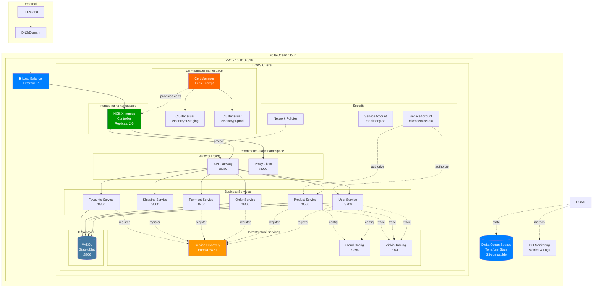
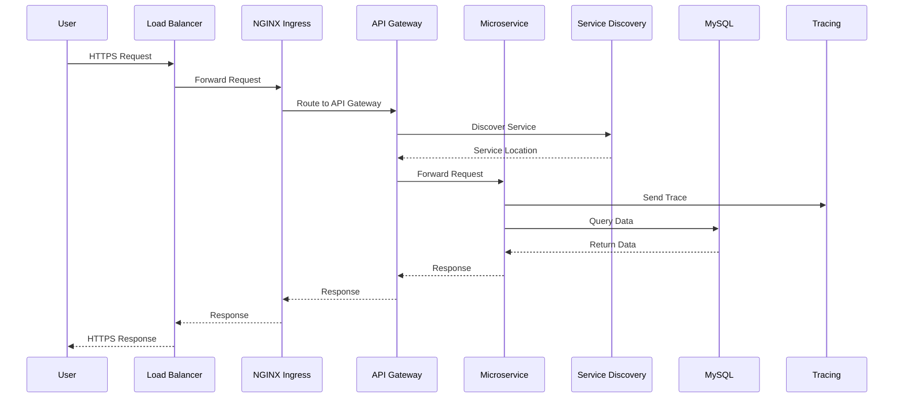

# Arquitectura de Infraestructura - DigitalOcean Kubernetes

## Visión General

Esta infraestructura implementa una arquitectura de microservicios en DigitalOcean Kubernetes (DOKS) utilizando Terraform como herramienta de Infrastructure as Code (IaC).

## Diagrama de Arquitectura Completa

## Capas de la Arquitectura

### 1. Capa de Entrada (Ingress Layer)

**Componentes:**
- **DigitalOcean Load Balancer**: Punto de entrada externo, distribuye tráfico
- **NGINX Ingress Controller**: Enrutamiento HTTP/HTTPS, terminación TLS

**Características:**
- Auto-scaling: 2-5 réplicas
- Health checks automáticos
- SSL/TLS termination
- Path-based routing

### 2. Capa de Gateway

**Componentes:**
- **API Gateway**: Punto de entrada unificado para clientes externos
- **Proxy Client**: Cliente proxy para comunicación entre servicios

**Responsabilidades:**
- Autenticación y autorización
- Rate limiting
- Request/Response transformation
- Circuit breaking

### 3. Capa de Servicios de Negocio

**Microservicios:**
- **User Service**: Gestión de usuarios
- **Product Service**: Catálogo de productos
- **Order Service**: Procesamiento de pedidos
- **Payment Service**: Procesamiento de pagos
- **Shipping Service**: Gestión de envíos
- **Favourite Service**: Favoritos de usuarios

**Patrones Implementados:**
- Service Discovery (Eureka)
- Distributed Tracing (Zipkin)
- Centralized Configuration (Spring Cloud Config)
- Database per Service

### 4. Capa de Infraestructura

**Componentes:**
- **Service Discovery (Eureka)**: Registro y descubrimiento de servicios
- **Cloud Config**: Configuración centralizada
- **Zipkin**: Distributed tracing

### 5. Capa de Datos

**Componentes:**
- **MySQL StatefulSet**: Base de datos relacional
- **Persistent Volumes**: Almacenamiento persistente

### 6. Capa de Seguridad

**Componentes:**
- **Cert-Manager**: Gestión automática de certificados TLS
- **RBAC**: Control de acceso basado en roles
- **Network Policies**: Aislamiento de red entre namespaces
- **Service Accounts**: Identidades para pods

## Flujo de Datos

## Módulos de Terraform

### 1. VPC Module

**Propósito**: Aislamiento de red

**Recursos:**
- `digitalocean_vpc`: Red privada virtual

**Configuración:**
- CIDR: 10.10.0.0/16 (stage), 10.20.0.0/16 (prod)
- Region: nyc1

### 2. DOKS Cluster Module

**Propósito**: Clúster de Kubernetes gestionado

**Recursos:**
- `digitalocean_kubernetes_cluster`: Clúster DOKS
- Node pools con auto-scaling

**Configuración:**
- Kubernetes version: 1.31.1-do.4
- Node size: s-2vcpu-2gb (stage), s-4vcpu-8gb (prod)
- Auto-scale: 2-5 nodes (stage), 3-10 nodes (prod)

### 3. RBAC Module

**Propósito**: Seguridad y control de acceso

**Recursos:**
- `kubernetes_namespace`: Namespaces aislados
- `kubernetes_service_account`: Identidades para pods
- `kubernetes_role`: Permisos namespace-scoped
- `kubernetes_cluster_role`: Permisos cluster-wide
- `kubernetes_network_policy`: Políticas de red

**Configuración:**
- Namespaces: ecommerce-stage, monitoring, ingress-nginx
- Service Accounts: microservices-sa, monitoring-sa
- Network Policies: default-deny, allow-same-namespace

### 4. Cert-Manager Module

**Propósito**: Gestión automática de certificados TLS

**Recursos:**
- `helm_release.cert_manager`: Instalación vía Helm
- `kubernetes_manifest`: ClusterIssuers

**Configuración:**
- Let's Encrypt Staging
- Let's Encrypt Production
- Self-signed (fallback)

### 5. Ingress NGINX Module

**Propósito**: Load balancing y routing HTTP/HTTPS

**Recursos:**
- `helm_release.ingress_nginx`: NGINX Ingress Controller
- `data.kubernetes_service`: Load Balancer IP

**Configuración:**
- Auto-scaling: 2-5 réplicas
- Resource limits: 500m CPU, 512Mi RAM
- Metrics enabled

## Ambientes

### Stage Environment

**Propósito**: Desarrollo y pruebas

**Configuración:**
- 3 nodos s-2vcpu-2gb
- Auto-scale: 2-5 nodos
- Sin HA
- Auto-upgrade: Deshabilitado
- Costo: ~$53/mes

### Production Environment

**Propósito**: Producción

**Configuración:**
- 3 nodos s-4vcpu-8gb
- Auto-scale: 3-10 nodos
- HA habilitado
- Auto-upgrade: Habilitado
- Costo: ~$201/mes

## Backend Remoto

**Servicio**: DigitalOcean Spaces (S3-compatible)

**Configuración:**
- Bucket: ecommerce-terraform-state
- Keys separadas por ambiente:
  - stage/terraform.tfstate
  - production/terraform.tfstate

**Ventajas:**
- State locking
- Versionado
- Colaboración en equipo
- Backup automático

## Seguridad

### Network Policies

1. **default-deny-ingress**: Bloquea todo el tráfico entrante por defecto
2. **allow-same-namespace**: Permite comunicación intra-namespace
3. **allow-ingress-traffic**: Permite tráfico desde ingress-nginx

### RBAC

**Service Accounts:**
- microservices-sa: Para microservicios de negocio
- monitoring-sa: Para herramientas de monitoreo

**Permisos:**
- ConfigMaps/Secrets: get, list, watch
- Services/Pods: get, list
- Nodes (monitoring): get, list, watch

### TLS/SSL

**Cert-Manager** gestiona automáticamente:
- Emisión de certificados
- Renovación automática
- Múltiples issuers (staging, prod, self-signed)

## Monitoreo y Observabilidad

### Métricas

- **DigitalOcean Monitoring**: Métricas de nodos y clúster
- **NGINX Metrics**: Métricas de ingress
- **Kubernetes Metrics Server**: Métricas de pods

### Tracing

- **Zipkin**: Distributed tracing para microservicios
- Correlación de requests entre servicios
- Análisis de latencia

### Logs

- **DigitalOcean Logs**: Logs centralizados
- Logs de aplicación
- Logs de sistema

## Escalabilidad

### Horizontal Pod Autoscaling (HPA)

- NGINX Ingress: 2-5 réplicas
- Microservicios: Configurables vía HPA

### Cluster Autoscaling

- Stage: 2-5 nodos
- Production: 3-10 nodos
- Basado en utilización de CPU/memoria

## Alta Disponibilidad

### Production

- **Control Plane HA**: 3 master nodes
- **Multi-AZ**: Nodos distribuidos
- **Load Balancer**: Redundante
- **Database**: StatefulSet con réplicas

### Stage

- **Single Control Plane**: 1 master node
- **Multi-node**: 3 worker nodes
- **Load Balancer**: Standard

## Disaster Recovery

### Backup

- **Terraform State**: Versionado en Spaces
- **Database**: Snapshots automáticos
- **Configuración**: Git repository

### Recovery

1. Restaurar state desde Spaces
2. Ejecutar `terraform apply`
3. Restaurar database desde snapshot
4. Redesplegar microservicios

## Mejores Prácticas Implementadas

✅ **Infrastructure as Code**: Todo definido en Terraform
✅ **Modularización**: Módulos reutilizables
✅ **Multi-ambiente**: Stage y Production separados
✅ **Remote State**: Estado centralizado y versionado
✅ **RBAC**: Control de acceso granular
✅ **Network Policies**: Aislamiento de red
✅ **TLS Automático**: Cert-manager con Let's Encrypt
✅ **Auto-scaling**: Pods y nodos
✅ **Monitoring**: Métricas y logs centralizados
✅ **Tracing**: Distributed tracing con Zipkin
✅ **Service Discovery**: Eureka para registro de servicios
✅ **Centralized Config**: Spring Cloud Config
✅ **GitOps Ready**: Preparado para CI/CD

## Próximos Pasos

1. **CI/CD**: Implementar pipeline con GitHub Actions
2. **Helm Charts**: Migrar microservicios a Helm
3. **Service Mesh**: Evaluar Istio/Linkerd
4. **Observability**: Prometheus + Grafana
5. **Backup Automation**: Velero para backups de Kubernetes
6. **Cost Optimization**: Spot instances, resource optimization
