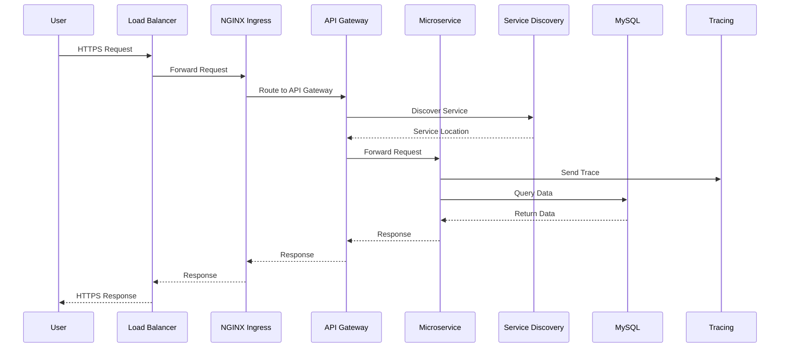

# Arquitectura de Infraestructura - DigitalOcean Kubernetes

## Visión General

Esta infraestructura implementa una arquitectura de microservicios en DigitalOcean Kubernetes (DOKS) utilizando Terraform como herramienta de Infrastructure as Code (IaC).

## Arquitectura de Alto Nivel

```
┌─────────────────────────────────────────────────────────────────────────────┐
│                      DigitalOcean Cloud - Region: nyc1                      │
│                                                                              │
│  ┌──────────────────────────────────────────────────────────────────────┐  │
│  │  VPC: ecommerce-vpc-{env}                                            │  │
│  │  CIDR: 172.16.0.0/16 (stage) / 172.17.0.0/16 (production)           │  │
│  │                                                                       │  │
│  │  ┌─────────────────────────────────────────────────────────────────┐ │  │
│  │  │  DigitalOcean Load Balancer                                     │ │  │
│  │  │  Name: ecommerce-lb-{env}                                      │ │  │
│  │  │  Type: HTTP/HTTPS                                               │ │  │
│  │  │  External IP: [Dynamic]                                         │ │  │
│  │  └─────────────────────────────────────────────────────────────────┘ │  │
│  │                                                                       │  │
│  │  ┌─────────────────────────────────────────────────────────────────┐ │  │
│  │  │  DOKS Cluster: ecommerce-k8s-{env}                            │ │  │
│  │  │  Kubernetes Version: 1.33.6-do.0                                │ │  │
│  │  │  HA Control Plane: {false (stage) / true (prod)}              │ │  │
│  │  │                                                                 │ │  │
│  │  │  ┌───────────────────────────────────────────────────────────┐ │ │  │
│  │  │  │  Node Pool: worker-pool                                   │ │ │  │
│  │  │  │  Size: s-4vcpu-8gb                                         │ │ │  │
│  │  │  │  Initial Count: 3 nodes                                    │ │ │  │
│  │  │  │  Auto-scale: 2-5 (stage) / 3-10 (prod)                    │ │ │  │
│  │  │  │  ┌──────────┐  ┌──────────┐  ┌──────────┐                │ │ │  │
│  │  │  │  │ Worker 1 │  │ Worker 2 │  │ Worker 3 │                │ │ │  │
│  │  │  │  └──────────┘  └──────────┘  └──────────┘                │ │ │  │
│  │  │  └───────────────────────────────────────────────────────────┘ │ │  │
│  │  │                                                                 │ │  │
│  │  │  ┌───────────────────────────────────────────────────────────┐ │ │  │
│  │  │  │  Namespace: ingress-nginx                                 │ │ │  │
│  │  │  │  ┌─────────────────────────────────────────────────────┐  │ │ │  │
│  │  │  │  │  NGINX Ingress Controller                           │  │ │ │  │
│  │  │  │  │  Helm Chart: v4.8.3                                 │  │ │ │  │
│  │  │  │  │  Replicas: 2-5 (auto-scaling)                       │  │ │ │  │
│  │  │  │  │  Resources: 500m CPU / 512Mi RAM                    │  │ │ │  │
│  │  │  │  └─────────────────────────────────────────────────────┘  │ │ │  │
│  │  │  └───────────────────────────────────────────────────────────┘ │ │  │
│  │  │                                                                 │ │  │
│  │  │  ┌───────────────────────────────────────────────────────────┐ │ │  │
│  │  │  │  Namespace: ecommerce-{env}                               │ │ │  │
│  │  │  │                                                           │ │ │  │
│  │  │  │  ┌─────────────────────────────────────────────────────┐ │ │ │  │
│  │  │  │  │  Gateway Layer                                       │ │ │ │  │
│  │  │  │  │  ┌──────────────────┐  ┌──────────────────┐         │ │ │ │  │
│  │  │  │  │  │  API Gateway     │  │  Proxy Client    │         │ │ │ │  │
│  │  │  │  │  │  Port: 8080      │  │  Port: 8900      │         │ │ │ │  │
│  │  │  │  │  │  Spring Gateway  │  │  Auth & Authz    │         │ │ │ │  │
│  │  │  │  │  └──────────────────┘  └──────────────────┘         │ │ │ │  │
│  │  │  │  └─────────────────────────────────────────────────────┘ │ │ │  │
│  │  │  │                                                           │ │ │  │
│  │  │  │  ┌─────────────────────────────────────────────────────┐ │ │ │  │
│  │  │  │  │  Business Services                                   │ │ │ │  │
│  │  │  │  │  ┌──────────────┐  ┌──────────────┐                │ │ │ │  │
│  │  │  │  │  │ User Service │  │Product Service│               │ │ │ │  │
│  │  │  │  │  │ Port: 8700   │  │ Port: 8500   │                │ │ │ │  │
│  │  │  │  │  └──────────────┘  └──────────────┘                │ │ │ │  │
│  │  │  │  │  ┌──────────────┐  ┌──────────────┐                │ │ │ │  │
│  │  │  │  │  │Order Service │  │Payment Service│               │ │ │ │  │
│  │  │  │  │  │ Port: 8300   │  │ Port: 8400   │                │ │ │ │  │
│  │  │  │  │  └──────────────┘  └──────────────┘                │ │ │ │  │
│  │  │  │  │  ┌──────────────┐  ┌──────────────┐                │ │ │ │  │
│  │  │  │  │  │Shipping Svc  │  │Favourite Svc │                │ │ │ │  │
│  │  │  │  │  │ Port: 8600   │  │ Port: 8800   │                │ │ │ │  │
│  │  │  │  │  └──────────────┘  └──────────────┘                │ │ │ │  │
│  │  │  │  └─────────────────────────────────────────────────────┘ │ │ │  │
│  │  │  │                                                           │ │ │  │
│  │  │  │  ┌─────────────────────────────────────────────────────┐ │ │ │  │
│  │  │  │  │  Infrastructure Services                             │ │ │ │  │
│  │  │  │  │  ┌──────────────┐  ┌──────────────┐                │ │ │ │  │
│  │  │  │  │  │ Eureka       │  │ Cloud Config │                │ │ │ │  │
│  │  │  │  │  │ Port: 8761   │  │ Port: 9296   │                │ │ │ │  │
│  │  │  │  │  │ Service Disc │  │ Config Server │               │ │ │ │  │
│  │  │  │  │  └──────────────┘  └──────────────┘                │ │ │ │  │
│  │  │  │  │  ┌──────────────┐                                   │ │ │ │  │
│  │  │  │  │  │ Zipkin       │                                   │ │ │ │  │
│  │  │  │  │  │ Port: 9411   │                                   │ │ │ │  │
│  │  │  │  │  │ Distributed  │                                   │ │ │ │  │
│  │  │  │  │  │ Tracing      │                                   │ │ │ │  │
│  │  │  │  │  └──────────────┘                                   │ │ │ │  │
│  │  │  │  └─────────────────────────────────────────────────────┘ │ │ │  │
│  │  │  │                                                           │ │ │  │
│  │  │  │  ┌─────────────────────────────────────────────────────┐ │ │ │  │
│  │  │  │  │  Data Layer                                         │ │ │ │  │
│  │  │  │  │  ┌──────────────────────────────────────────────┐  │ │ │ │  │
│  │  │  │  │  │  MySQL StatefulSet                            │  │ │ │ │  │
│  │  │  │  │  │  Port: 3306                                   │  │ │ │ │  │
│  │  │  │  │  │  Persistent Volume                             │  │ │ │ │  │
│  │  │  │  │  └──────────────────────────────────────────────┘  │ │ │ │  │
│  │  │  │  └─────────────────────────────────────────────────────┘ │ │ │  │
│  │  │  │                                                           │ │ │  │
│  │  │  │  ┌─────────────────────────────────────────────────────┐ │ │ │  │
│  │  │  │  │  Security & RBAC                                    │ │ │ │  │
│  │  │  │  │  ┌──────────────┐  ┌──────────────┐                │ │ │ │  │
│  │  │  │  │  │ ServiceAccount│  │ Network      │                │ │ │ │  │
│  │  │  │  │  │ microservices │  │ Policies     │                │ │ │ │  │
│  │  │  │  │  │ -sa           │  │ - default-  │                │ │ │ │  │
│  │  │  │  │  │ monitoring-sa │  │   deny-     │                │ │ │ │  │
│  │  │  │  │  └──────────────┘  │   ingress    │                │ │ │ │  │
│  │  │  │  │                    │ - allow-same- │                │ │ │ │  │
│  │  │  │  │                    │   namespace  │                │ │ │ │  │
│  │  │  │  │                    │ - allow-     │                │ │ │ │  │
│  │  │  │  │                    │   ingress-   │                │ │ │ │  │
│  │  │  │  │                    │   traffic    │                │ │ │ │  │
│  │  │  │  │                    └──────────────┘                │ │ │ │  │
│  │  │  │  └─────────────────────────────────────────────────────┘ │ │ │  │
│  │  │  └───────────────────────────────────────────────────────────┘ │ │  │
│  │  │                                                                 │ │  │
│  │  │  ┌───────────────────────────────────────────────────────────┐ │ │  │
│  │  │  │  Namespace: cert-manager                                    │ │ │  │
│  │  │  │  ┌─────────────────────────────────────────────────────┐  │ │ │  │
│  │  │  │  │  Cert-Manager                                       │  │ │ │  │
│  │  │  │  │  Helm Chart: v1.13.3                                │  │ │ │  │
│  │  │  │  │  ┌──────────────┐  ┌──────────────┐              │  │ │ │  │
│  │  │  │  │  │ ClusterIssuer │  │ ClusterIssuer│              │  │ │ │  │
│  │  │  │  │  │ letsencrypt-  │  │ letsencrypt- │              │  │ │ │  │
│  │  │  │  │  │ staging       │  │ prod         │              │  │ │ │  │
│  │  │  │  │  └──────────────┘  └──────────────┘              │  │ │ │  │
│  │  │  │  └─────────────────────────────────────────────────────┘  │ │ │  │
│  │  │  └───────────────────────────────────────────────────────────┘ │ │  │
│  │  │                                                                 │ │  │
│  │  │  ┌───────────────────────────────────────────────────────────┐ │ │  │
│  │  │  │  Namespace: monitoring                                    │ │ │  │
│  │  │  │  ┌─────────────────────────────────────────────────────┐  │ │ │  │
│  │  │  │  │  Monitoring Tools                                    │  │ │ │  │
│  │  │  │  │  - Prometheus (Metrics Collection)                   │  │ │ │  │
│  │  │  │  │  - Grafana (Visualization)                           │  │ │ │  │
│  │  │  │  │  - ServiceAccount: monitoring-sa                     │  │ │ │  │
│  │  │  │  └─────────────────────────────────────────────────────┘  │ │ │  │
│  │  │  └───────────────────────────────────────────────────────────┘ │ │  │
│  │  └─────────────────────────────────────────────────────────────────┘ │  │
│  └──────────────────────────────────────────────────────────────────────┘  │
│                                                                              │
│  ┌──────────────────────────────────────────────────────────────────────┐  │
│  │  DigitalOcean Spaces (Terraform State Backend)                        │  │
│  │  - Bucket: ecommerce-terraform-state                                  │  │
│  │  - Keys: stage/terraform.tfstate, production/terraform.tfstate       │  │
│  │  - State locking enabled                                               │  │
│  └──────────────────────────────────────────────────────────────────────┘  │
│                                                                              │
│  ┌──────────────────────────────────────────────────────────────────────┐  │
│  │  DigitalOcean Monitoring                                             │  │
│  │  - Cluster Metrics                                                    │  │
│  │  - Node Metrics                                                        │  │
│  │  - Application Logs                                                   │  │
│  └──────────────────────────────────────────────────────────────────────┘  │
└─────────────────────────────────────────────────────────────────────────────┘

Flujo de Datos:
┌─────────┐
│ Usuario │
└────┬────┘
     │ HTTPS/HTTP
     ▼
┌─────────────────┐
│ Load Balancer   │
│ ecommerce-lb-*  │
└────┬────────────┘
     │
     ▼
┌─────────────────┐
│ NGINX Ingress   │
│ Controller      │
└────┬────────────┘
     │
     ├─────────────┐
     │             │
     ▼             ▼
┌─────────┐   ┌──────────┐
│ API     │   │ Proxy   │
│ Gateway │   │ Client  │
└────┬────┘   └──────────┘
     │
     ├──► User Service ──► MySQL
     ├──► Product Service ──► MySQL
     ├──► Order Service ──► MySQL
     ├──► Payment Service
     ├──► Shipping Service
     └──► Favourite Service ──► MySQL

Service Discovery & Configuration:
     ┌─────────────┐
     │   Eureka    │◄─── All Services register here
     └─────────────┘
     
     ┌─────────────┐
     │Cloud Config │◄─── All Services get config from here
     └─────────────┘

Distributed Tracing:
     ┌─────────────┐
     │   Zipkin     │◄─── All Services send traces here
     └─────────────┘
```

## Diagrama de Arquitectura Completo

```mermaid
graph TB
    subgraph "External"
        USER_EXT[👤 Usuario]
        DNS[DNS/Domain]
    end
    
    subgraph "DigitalOcean Cloud - Region: nyc1"
        subgraph "VPC - 172.16.0.0/16 (stage) / 172.17.0.0/16 (prod)"
            LB[🌐 DigitalOcean Load Balancer<br/>ecommerce-lb-{env}<br/>External IP]
            
            subgraph "DOKS Cluster - ecommerce-k8s-{env}<br/>K8s v1.33.6-do.0"
                subgraph "Node Pool - worker-pool<br/>s-4vcpu-8gb | Auto-scale: 2-5 (stage) / 3-10 (prod)"
                    NODE1[Worker Node 1]
                    NODE2[Worker Node 2]
                    NODE3[Worker Node 3]
                end
                
                subgraph "ingress-nginx namespace"
                    NGINX[NGINX Ingress Controller<br/>Helm Chart v4.8.3<br/>Auto-scaling: 2-5 replicas<br/>Resources: 500m CPU / 512Mi RAM]
                end
                
                subgraph "ecommerce-{env} namespace"
                    subgraph "Gateway Layer"
                        API[API Gateway<br/>Port: 8080<br/>Spring Cloud Gateway]
                        PROXY[Proxy Client<br/>Port: 8900<br/>Auth & Authorization]
                    end
                    
                    subgraph "Business Services"
                        USER_SVC[User Service<br/>Port: 8700<br/>User Management]
                        PROD_SVC[Product Service<br/>Port: 8500<br/>Product Catalog]
                        ORDER_SVC[Order Service<br/>Port: 8300<br/>Order Processing]
                        PAY_SVC[Payment Service<br/>Port: 8400<br/>Payment Processing]
                        SHIP_SVC[Shipping Service<br/>Port: 8600<br/>Shipping Management]
                        FAV_SVC[Favourite Service<br/>Port: 8800<br/>Favourites Management]
                    end
                    
                    subgraph "Infrastructure Services"
                        EUREKA[Service Discovery<br/>Eureka Server<br/>Port: 8761]
                        CONFIG[Cloud Config<br/>Spring Cloud Config<br/>Port: 9296]
                        ZIPKIN[Zipkin Tracing<br/>Distributed Tracing<br/>Port: 9411]
                    end
                    
                    subgraph "Data Layer"
                        MYSQL[(MySQL StatefulSet<br/>Port: 3306<br/>Persistent Volume)]
                    end
                end
                
                subgraph "cert-manager namespace"
                    CM[Cert Manager<br/>Helm Chart v1.13.3<br/>Let's Encrypt Integration]
                    ISSUER_STAGE[ClusterIssuer<br/>letsencrypt-staging]
                    ISSUER_PROD[ClusterIssuer<br/>letsencrypt-prod]
                end
                
                subgraph "monitoring namespace"
                    MONITORING_TOOLS[Monitoring Tools<br/>Prometheus / Grafana]
                end
                
                subgraph "Security & RBAC"
                    SA_MS[ServiceAccount<br/>microservices-sa<br/>Namespace-scoped Role]
                    SA_MON[ServiceAccount<br/>monitoring-sa<br/>Cluster-scoped Role]
                    NP[Network Policies<br/>default-deny-ingress<br/>allow-same-namespace<br/>allow-ingress-traffic]
                end
            end
        end
        
        SPACES[(DigitalOcean Spaces<br/>Terraform State Backend<br/>S3-compatible Storage)]
        DO_MONITORING[DO Monitoring<br/>Metrics & Logs<br/>Cluster & Node Metrics]
    end
    
    USER_EXT --> DNS
    DNS --> LB
    LB -->|HTTPS/HTTP| NGINX
    NGINX -->|Route| API
    NGINX -->|Route| PROXY
    
    API -->|Forward| USER_SVC
    API -->|Forward| PROD_SVC
    API -->|Forward| ORDER_SVC
    API -->|Forward| PAY_SVC
    API -->|Forward| SHIP_SVC
    API -->|Forward| FAV_SVC
    
    USER_SVC -.register.-> EUREKA
    PROD_SVC -.register.-> EUREKA
    ORDER_SVC -.register.-> EUREKA
    PAY_SVC -.register.-> EUREKA
    SHIP_SVC -.register.-> EUREKA
    FAV_SVC -.register.-> EUREKA
    API -.register.-> EUREKA
    PROXY -.register.-> EUREKA
    
    USER_SVC -.config.-> CONFIG
    PROD_SVC -.config.-> CONFIG
    ORDER_SVC -.config.-> CONFIG
    PAY_SVC -.config.-> CONFIG
    SHIP_SVC -.config.-> CONFIG
    FAV_SVC -.config.-> CONFIG
    
    USER_SVC -->|JDBC| MYSQL
    PROD_SVC -->|JDBC| MYSQL
    ORDER_SVC -->|JDBC| MYSQL
    FAV_SVC -->|JDBC| MYSQL
    
    USER_SVC -.trace.-> ZIPKIN
    PROD_SVC -.trace.-> ZIPKIN
    ORDER_SVC -.trace.-> ZIPKIN
    PAY_SVC -.trace.-> ZIPKIN
    SHIP_SVC -.trace.-> ZIPKIN
    FAV_SVC -.trace.-> ZIPKIN
    
    CM --> ISSUER_STAGE
    CM --> ISSUER_PROD
    CM -.provision TLS certs.-> NGINX
    
    SA_MS -.authorize.-> USER_SVC
    SA_MS -.authorize.-> PROD_SVC
    SA_MS -.authorize.-> ORDER_SVC
    SA_MS -.authorize.-> PAY_SVC
    SA_MS -.authorize.-> SHIP_SVC
    SA_MS -.authorize.-> FAV_SVC
    
    NP -.protect.-> API
    NP -.protect.-> PROXY
    NP -.isolate.-> USER_SVC
    
    NODE1 -.hosts.-> NGINX
    NODE1 -.hosts.-> API
    NODE1 -.hosts.-> USER_SVC
    NODE2 -.hosts.-> PROXY
    NODE2 -.hosts.-> PROD_SVC
    NODE2 -.hosts.-> ORDER_SVC
    NODE3 -.hosts.-> PAY_SVC
    NODE3 -.hosts.-> SHIP_SVC
    NODE3 -.hosts.-> FAV_SVC
    
    DOKS -.terraform state.-> SPACES
    DOKS -.metrics.-> DO_MONITORING
    DOKS -.logs.-> DO_MONITORING
    
    style LB fill:#0080ff,color:#fff
    style NGINX fill:#009900,color:#fff
    style CM fill:#ff6600,color:#fff
    style MYSQL fill:#4479a1,color:#fff
    style EUREKA fill:#ff9800,color:#fff
    style SPACES fill:#0080ff,color:#fff
    style DO_MONITORING fill:#0066cc,color:#fff
    style NODE1 fill:#e0e0e0
    style NODE2 fill:#e0e0e0
    style NODE3 fill:#e0e0e0
```

## Capas de la Arquitectura

### 1. Capa de Entrada (Ingress Layer)

**Componentes:**
- **DigitalOcean Load Balancer**: Punto de entrada externo, distribuye tráfico
- **NGINX Ingress Controller**: Enrutamiento HTTP/HTTPS, terminación TLS

**Características:**
- Auto-scaling: 2-5 réplicas
- Health checks automáticos
- SSL/TLS termination
- Path-based routing

### 2. Capa de Gateway

**Componentes:**
- **API Gateway**: Punto de entrada unificado para clientes externos
- **Proxy Client**: Cliente proxy para comunicación entre servicios

**Responsabilidades:**
- Autenticación y autorización
- Rate limiting
- Request/Response transformation
- Circuit breaking

### 3. Capa de Servicios de Negocio

**Microservicios:**
- **User Service**: Gestión de usuarios
- **Product Service**: Catálogo de productos
- **Order Service**: Procesamiento de pedidos
- **Payment Service**: Procesamiento de pagos
- **Shipping Service**: Gestión de envíos
- **Favourite Service**: Favoritos de usuarios

**Patrones Implementados:**
- Service Discovery (Eureka)
- Distributed Tracing (Zipkin)
- Centralized Configuration (Spring Cloud Config)
- Database per Service

### 4. Capa de Infraestructura

**Componentes:**
- **Service Discovery (Eureka)**: Registro y descubrimiento de servicios
- **Cloud Config**: Configuración centralizada
- **Zipkin**: Distributed tracing

### 5. Capa de Datos

**Componentes:**
- **MySQL StatefulSet**: Base de datos relacional
- **Persistent Volumes**: Almacenamiento persistente

### 6. Capa de Seguridad

**Componentes:**
- **Cert-Manager**: Gestión automática de certificados TLS
- **RBAC**: Control de acceso basado en roles
- **Network Policies**: Aislamiento de red entre namespaces
- **Service Accounts**: Identidades para pods

## Flujo de Datos



## Módulos de Terraform

### 1. VPC Module

**Propósito**: Aislamiento de red

**Recursos:**
- `digitalocean_vpc`: Red privada virtual

**Configuración:**
- CIDR: 10.10.0.0/16 (stage), 10.20.0.0/16 (prod)
- Region: nyc1

### 2. DOKS Cluster Module

**Propósito**: Clúster de Kubernetes gestionado

**Recursos:**
- `digitalocean_kubernetes_cluster`: Clúster DOKS
- Node pools con auto-scaling

**Configuración:**
- Kubernetes version: 1.33.6-do.0
- Node size: s-4vcpu-8gb (ambos ambientes)
- Node count inicial: 3 nodes
- Auto-scale: 2-5 nodes (stage), 3-10 nodes (production)
- HA Control Plane: false (stage), true (production)
- Auto-upgrade: false (stage), true (production)
- Surge upgrade: true (ambos)
- Maintenance window: Sunday 04:00

### 3. RBAC Module

**Propósito**: Seguridad y control de acceso

**Recursos:**
- `kubernetes_namespace`: Namespaces aislados
- `kubernetes_service_account`: Identidades para pods
- `kubernetes_role`: Permisos namespace-scoped
- `kubernetes_cluster_role`: Permisos cluster-wide
- `kubernetes_network_policy`: Políticas de red

**Configuración:**
- Namespaces: ecommerce-{environment}, monitoring, ingress-nginx
- Service Accounts: 
  - microservices-sa (namespace-scoped, ecommerce-{env})
  - monitoring-sa (cluster-scoped, monitoring namespace)
- Roles:
  - microservices-role: get/list/watch ConfigMaps, Secrets, Services, Pods
  - monitoring-reader: get/list/watch Nodes, Services, Endpoints, Pods, Deployments
- Network Policies:
  - default-deny-ingress: Bloquea todo tráfico entrante por defecto
  - allow-same-namespace: Permite comunicación intra-namespace
  - allow-ingress-traffic: Permite tráfico desde ingress-nginx a gateways

### 4. Cert-Manager Module

**Propósito**: Gestión automática de certificados TLS

**Recursos:**
- `helm_release.cert_manager`: Instalación vía Helm
- `kubernetes_manifest`: ClusterIssuers

**Configuración:**
- Helm Chart: cert-manager v1.13.3
- ClusterIssuers:
  - letsencrypt-staging (acme-staging-v02.api.letsencrypt.org)
  - letsencrypt-prod (acme-v02.api.letsencrypt.org)
  - selfsigned-issuer (fallback)
- HTTP01 challenge solver con NGINX ingress class

### 5. Ingress NGINX Module

**Propósito**: Load balancing y routing HTTP/HTTPS

**Recursos:**
- `helm_release.ingress_nginx`: NGINX Ingress Controller
- `data.kubernetes_service`: Load Balancer IP

**Configuración:**
- Helm Chart: ingress-nginx v4.8.3
- Service Type: LoadBalancer (DigitalOcean Load Balancer)
- Load Balancer Name: ecommerce-lb-{environment}
- Auto-scaling: 2-5 réplicas (HPA)
- Resource requests: 100m CPU, 128Mi RAM
- Resource limits: 500m CPU, 512Mi RAM
- Metrics: enabled
- SSL redirect: configurable (depende de enable_tls)

## Ambientes

### Stage Environment

**Propósito**: Desarrollo y pruebas

**Configuración:**
- 3 nodos s-4vcpu-8gb (inicial)
- Auto-scale: 2-5 nodos
- VPC: 172.16.0.0/16
- Sin HA (single control plane)
- Auto-upgrade: Deshabilitado (manual)
- Surge upgrade: Habilitado
- Monitoring: Habilitado
- Costo estimado: ~$120/mes (3 nodos base)

### Production Environment

**Propósito**: Producción

**Configuración:**
- 3 nodos s-4vcpu-8gb (inicial)
- Auto-scale: 3-10 nodos
- VPC: 172.17.0.0/16
- HA habilitado (3 master nodes)
- Auto-upgrade: Habilitado
- Surge upgrade: Habilitado
- Monitoring: Habilitado
- Costo estimado: ~$240/mes (3 nodos base + HA control plane)

## Backend Remoto

**Servicio**: DigitalOcean Spaces (S3-compatible)

**Configuración:**
- Bucket: ecommerce-terraform-state
- Keys separadas por ambiente:
  - stage/terraform.tfstate
  - production/terraform.tfstate

**Ventajas:**
- State locking
- Versionado
- Colaboración en equipo
- Backup automático

## Seguridad

### Network Policies

1. **default-deny-ingress**: Bloquea todo el tráfico entrante por defecto
2. **allow-same-namespace**: Permite comunicación intra-namespace
3. **allow-ingress-traffic**: Permite tráfico desde ingress-nginx

### RBAC

**Service Accounts:**
- microservices-sa: Para microservicios de negocio
- monitoring-sa: Para herramientas de monitoreo

**Permisos:**
- ConfigMaps/Secrets: get, list, watch
- Services/Pods: get, list
- Nodes (monitoring): get, list, watch

### TLS/SSL

**Cert-Manager** gestiona automáticamente:
- Emisión de certificados
- Renovación automática
- Múltiples issuers (staging, prod, self-signed)

## Monitoreo y Observabilidad

### Métricas

- **DigitalOcean Monitoring**: Métricas de nodos y clúster
- **NGINX Metrics**: Métricas de ingress
- **Kubernetes Metrics Server**: Métricas de pods

### Tracing

- **Zipkin**: Distributed tracing para microservicios
- Correlación de requests entre servicios
- Análisis de latencia

### Logs

- **DigitalOcean Logs**: Logs centralizados
- Logs de aplicación
- Logs de sistema

## Escalabilidad

### Horizontal Pod Autoscaling (HPA)

- NGINX Ingress: 2-5 réplicas
- Microservicios: Configurables vía HPA

### Cluster Autoscaling

- Stage: 2-5 nodos
- Production: 3-10 nodos
- Basado en utilización de CPU/memoria

## Alta Disponibilidad

### Production

- **Control Plane HA**: 3 master nodes
- **Multi-AZ**: Nodos distribuidos
- **Load Balancer**: Redundante
- **Database**: StatefulSet con réplicas

### Stage

- **Single Control Plane**: 1 master node
- **Multi-node**: 3 worker nodes
- **Load Balancer**: Standard

## Disaster Recovery

### Backup

- **Terraform State**: Versionado en Spaces
- **Database**: Snapshots automáticos
- **Configuración**: Git repository

### Recovery

1. Restaurar state desde Spaces
2. Ejecutar `terraform apply`
3. Restaurar database desde snapshot
4. Redesplegar microservicios

## Mejores Prácticas Implementadas

✅ **Infrastructure as Code**: Todo definido en Terraform
✅ **Modularización**: Módulos reutilizables
✅ **Multi-ambiente**: Stage y Production separados
✅ **Remote State**: Estado centralizado y versionado
✅ **RBAC**: Control de acceso granular
✅ **Network Policies**: Aislamiento de red
✅ **TLS Automático**: Cert-manager con Let's Encrypt
✅ **Auto-scaling**: Pods y nodos
✅ **Monitoring**: Métricas y logs centralizados
✅ **Tracing**: Distributed tracing con Zipkin
✅ **Service Discovery**: Eureka para registro de servicios
✅ **Centralized Config**: Spring Cloud Config
✅ **GitOps Ready**: Preparado para CI/CD

## Próximos Pasos

1. **CI/CD**: Implementar pipeline con GitHub Actions
2. **Helm Charts**: Migrar microservicios a Helm
3. **Service Mesh**: Evaluar Istio/Linkerd
4. **Observability**: Prometheus + Grafana
5. **Backup Automation**: Velero para backups de Kubernetes
6. **Cost Optimization**: Spot instances, resource optimization
