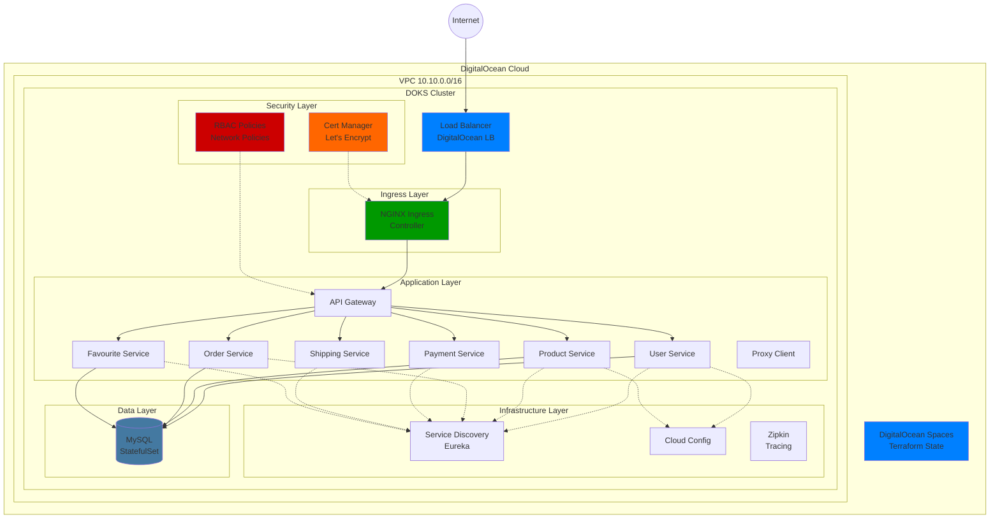
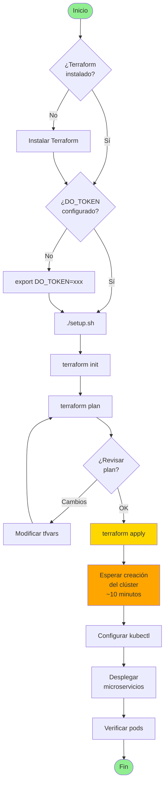
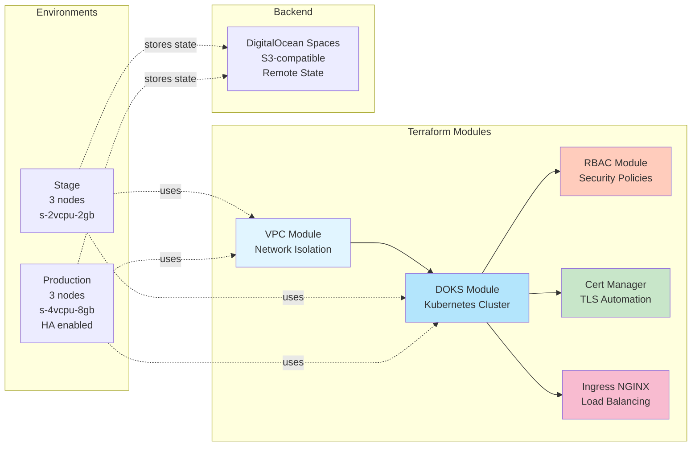

# DigitalOcean Kubernetes Infrastructure

Infraestructura como código (IaC) para desplegar microservicios de e-commerce en DigitalOcean Kubernetes (DOKS) usando Terraform.

## 📋 Tabla de Contenidos

- [Arquitectura](#arquitectura)
- [Requisitos](#requisitos)
- [Inicio Rápido](#inicio-rápido)
- [Estructura del Proyecto](#estructura-del-proyecto)
- [Configuración](#configuración)
- [Despliegue](#despliegue)
- [RBAC y Seguridad](#rbac-y-seguridad)
- [TLS/Certificados](#tlscertificados)
- [Múltiples Ambientes](#múltiples-ambientes)
- [Costos](#costos)
- [Troubleshooting](#troubleshooting)

## 🏗️ Arquitectura

### Diagrama de Infraestructura



### Diagrama de Flujo de Despliegue



### Diagrama de Componentes



## 📦 Requisitos

### Software Requerido

- **Terraform** >= 1.5.0
- **doctl** (DigitalOcean CLI) - Opcional pero recomendado
- **kubectl** >= 1.28
- **make** (para usar el Makefile)

### Cuenta de DigitalOcean

1. Crear cuenta en [DigitalOcean](https://www.digitalocean.com/)
2. Aplicar para créditos de estudiante (opcional): [GitHub Student Pack](https://www.digitalocean.com/github-students)
3. Generar API Token: [API Tokens](https://cloud.digitalocean.com/account/api/tokens)

## 🚀 Inicio Rápido

### 1. Configurar Token de API

```bash
export DO_TOKEN="tu-token-de-digitalocean"
```

### 2. Ejecutar Setup Automático

```bash
cd terraform-digitalocean
./setup.sh
```

### 3. Aplicar Infraestructura

```bash
make apply ENV=stage
```

### 4. Configurar kubectl

```bash
make kubeconfig ENV=stage
```

### 5. Verificar Clúster

```bash
kubectl get nodes
kubectl get namespaces
```

## 📁 Estructura del Proyecto

```
terraform-digitalocean/
├── main.tf                      # Configuración principal
├── variables.tf                 # Variables globales
├── outputs.tf                   # Outputs del root module
├── versions.tf                  # Providers y versiones
├── Makefile                     # Automatización de comandos
├── setup.sh                     # Script de setup interactivo
├── .gitignore                   # Archivos ignorados
│
├── modules/                     # Módulos reutilizables
│   ├── vpc/                     # VPC para aislamiento de red
│   ├── doks-cluster/            # Kubernetes cluster
│   ├── rbac/                    # RBAC y Network Policies
│   ├── cert-manager/            # Gestión de certificados TLS
│   └── ingress-nginx/           # Ingress controller
│
└── environments/                # Configuraciones por ambiente
    ├── stage/
    │   ├── terraform.tfvars     # Variables de stage
    │   └── backend.hcl          # Backend config de stage
    └── production/
        ├── terraform.tfvars     # Variables de production
        └── backend.hcl          # Backend config de production
```

## ⚙️ Configuración

### Variables Principales

Editar `environments/stage/terraform.tfvars`:

```hcl
environment        = "stage"
region             = "nyc1"
cluster_name       = "ecommerce-k8s"
kubernetes_version = "1.31.1-do.4"

node_pool = {
  name       = "worker-pool"
  size       = "s-2vcpu-2gb"
  node_count = 3
  auto_scale = true
  min_nodes  = 2
  max_nodes  = 5
  tags       = ["worker", "stage"]
}

enable_cert_manager = true
letsencrypt_email   = "tu-email@example.com"
```

## 🔧 Despliegue

### Usando Makefile (Recomendado)

```bash
make help              # Ver ayuda
make init ENV=stage    # Inicializar
make plan ENV=stage    # Planificar cambios
make apply ENV=stage   # Aplicar infraestructura
make kubeconfig ENV=stage  # Configurar kubectl
make status ENV=stage  # Ver estado del clúster
```

## 🔐 RBAC y Seguridad

El módulo RBAC crea automáticamente:

- **Service Accounts**: microservices-sa, monitoring-sa
- **Roles**: Permisos para ConfigMaps, Secrets, Services, Pods
- **Network Policies**: Aislamiento de namespaces

## 🔒 TLS/Certificados

Cert-manager configura tres ClusterIssuers:

1. **letsencrypt-staging**: Para pruebas
2. **letsencrypt-prod**: Para producción
3. **selfsigned-issuer**: Certificados autofirmados

## 🌍 Múltiples Ambientes

| Característica | Stage | Production |
|----------------|-------|------------|
| Node Size | s-2vcpu-2gb | s-4vcpu-8gb |
| Node Count | 3 | 3 |
| High Availability | No | Sí |
| Costo Mensual | ~$53 | ~$201 |

## 💰 Costos

**Stage**: ~$53/mes (DOKS gratis + 3 droplets + LB + Spaces)
**Production**: ~$201/mes (DOKS HA + 3 droplets grandes + LB + Spaces)

> 💡 Con $200 en créditos gratuitos, puedes correr stage por ~4 meses gratis.

## 🔍 Troubleshooting

Ver la documentación completa para soluciones a problemas comunes.

## 📚 Referencias

- [DigitalOcean Kubernetes](https://docs.digitalocean.com/products/kubernetes/)
- [Terraform DO Provider](https://registry.terraform.io/providers/digitalocean/digitalocean/latest/docs)
- [Cert-Manager](https://cert-manager.io/docs/)
- [NGINX Ingress](https://kubernetes.github.io/ingress-nginx/)
